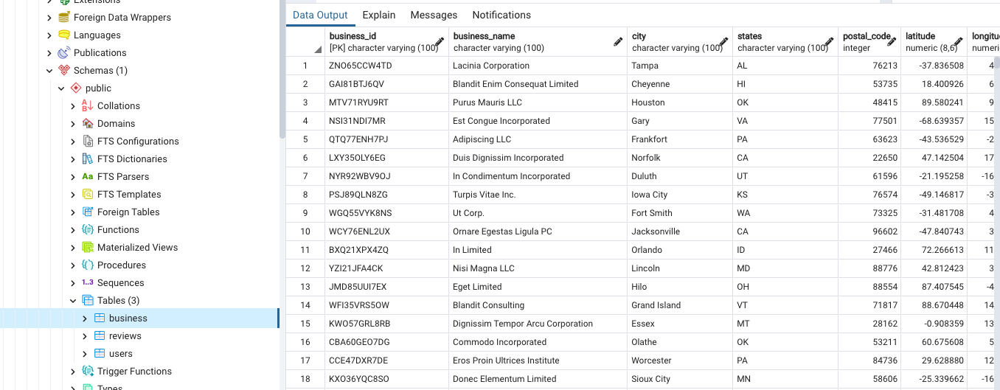
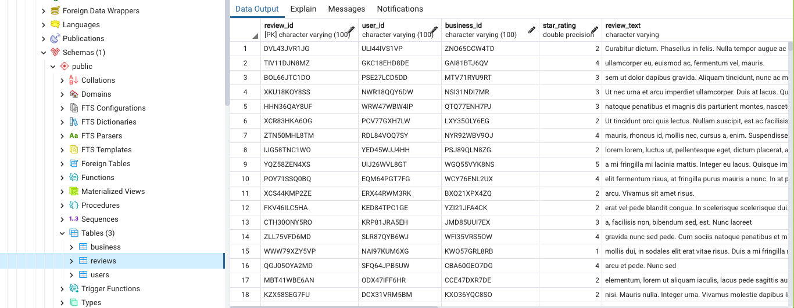
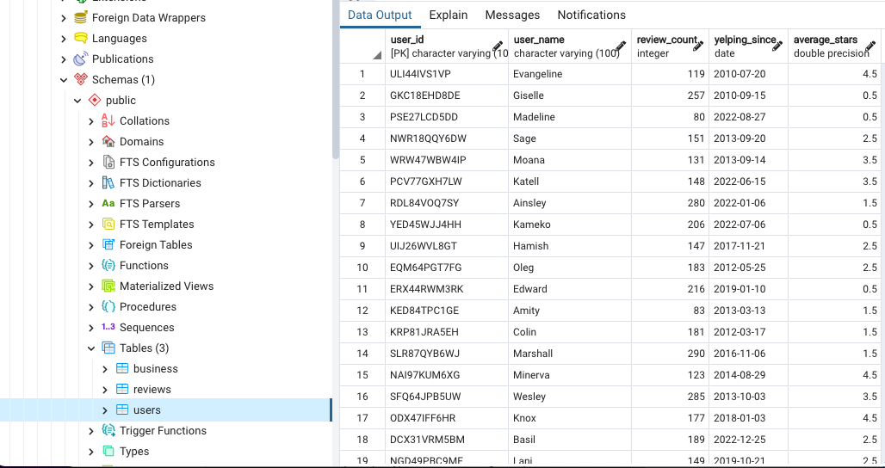
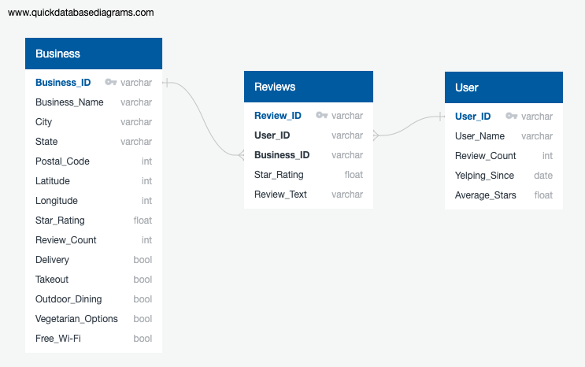

# Restaurant Rating Prediction Model

### Purpose 
The purpose of this project is to develop a Machine Learning model to predict a restaurant's success. 

Success is measured through **ratings** (from 1 to 5 stars) in the following manner:
- 4 to 5 - successful
- 3 to 3.9 - good
- 2 to 2.9 - average
- 1 to 1.9 - poor

We gathered data from **Yelp** on the top restaurant attributes associated with higher or lower ratings. Based on all possible combinations of these attributes, the model will make rating predictions.


---------------------------------------------------------------------------------------

### Background Information 
The COVID-19 pandemic has presented a multitude of constraints and economic downfalls, in which the restaurant industry has taken a big hit. Now, more than ever, restaurant owners can greatly benefit from the insights presented by what consumers currently value the most in the food industry--in order to best stand out from other local competitors. 

By accessing data on the top rated attributes, restaurant owners and investors can learn how to best appeal to the public in such ever-changing times. Just as the nature of our social interactions have changed, so have current demands and trends. Therefore, it is of critical importance for business owners to remain well informed on the story the data tells to better understand social transitions. 

The predictive model developed in this project can be applied to other regions and can also be used by various stakeholders, in analyzing upcoming opportunities and their advantages and disadvantages.


---------------------------------------------------------------------------------------

### Team Members & Communication Protocols

#### Our Team

In this group project, responsibilities were shared equally among all team members. Each team member participated in generating content for the various areas of the project. 

This is a layout of responsibilities per area that each member oversees:

| Member                                               | Responsibilities                                             |
| ---------------------------------------------------- | ------------------------------------------------------------ |
| [Aigerim Zhanibekova](https://github.com/Aigerim-Zh) | Manage the GitHub repository and README write-up; Data Cleaning; Machine Learning; ERD diagram |
| [Ana Bisker](https://github.com/anaorenstein)        | General Project Manager; Machine Learning Lead               |
| [Hristo Bustamante](https://github.com/hbustamante8) | Machine Learning; Data Cleaning; Database Creation           |
| [Leila Corvera Fontela](https://github.com/leilacf)  | Machine Learning; Data Cleaning; Database Creation; ERD diagram |
| [Ngoc Chau](https://github.com/Ngoclchau)            | Data Extraction; Data Cleaning; ERD diagram                  |

#### Communications

- Team members have allocated a regular slot for weekly meetings over Zoom in addition to the bi-weekly meetings that are held during class

- We created a shared Google Drive that contains various useful folders and data

- We structured our primary form of communication via Direct Messaging:

  - SMS group messages
  - Slack group

  

---------------------------------------------------------------------------------------

### Data Source
The data used in this project is [Yelp's businesses, reviews, and users subset data](https://www.kaggle.com/datasets/yelp-dataset/yelp-dataset?datasetId=10100&language=Python&outputs=null) from Kaggle. The same dataset is available in the same JSON format on the original [Yelp Dataset](https://www.yelp.com/dataset). 

- The original raw data contains business information across 8 metropolitan areas in the USA and Canada. For this project, we will focus on the USA and [TBD] states.

- The data was last updated on February 16, 2021.

- There are 150,346 records in total, which will be filtered to only restaurants resulting in [TBD] records.

  

---------------------------------------------------------------------------------------

### Questions We Aim to Answer 
- What attributes are the most important in making a restaurant more or less successful?

- How are the combination of attributes correlated with a restaurant's rating?

- Can we predict a restaurant's rating based on its current or potential attributes?

- Examples of Attributes:
    - Delivery 
    - Takeout
    - Outdoor Dining
    - Vegetarian Options
    - Free Wi-Fi
    
- Are there any significant differences across regions?

    

### Initial Hypotheses

- Null Hypothesis = **H0** = There is no correlation between the rating of a restaurant and a particular combination of attributes.
- Alternate Hypothesis =  **Ha** = There is correlation between the rating of a restaurant and a particular combination of attributes.


---------------------------------------------------------------------------------------

### Database
As part of this project, we will develop a database in **PostgreSQL** using **pgAdmin**. 

[Here](SQL/yelp_DB.sql) is the link to our SQL query.

As demonstrated in the **Entity Relationship Diagram** below, the database consits of three tables:

- Business

  

- Reviews

  

- User

  

  

The Business table has a one-to-many connection to the Reviews table through the Business_ID column.

The User table has a one-to-many connection to the Reviews table through the User_ID. 

The ERD specifies a data type for each column:





### Segment One

For **Segment 1** of this project, we used synthetic datasets generated through [generatedata.com](https://generatedata.com/generator). 
These are our custom-tailored synthetic datasets:

- [Business.csv](CSV_files/business_2.csv)
- [Reviews.csv](CSV_files/reviews_2.csv)
- [User.csv](CSV_files/user_2.csv)


---------------------------------------------------------------------------------------
### Data Transformation 
Since our data came in JSON format, it will require significant cleaning.

We expect the following data cleaning tasks:

- Filtering the data for restaurants. 
- Checking for data types, duplicates, and null values. 
- In the Business JSON dataset, all attributes of interest are in one column. Each attribute needs to be extracted in a separate column.
- Renaming and reordering columns in a readible format. 
- Finally, all JSON files will be converted to Pandas DataFrames and then to CSV files.


---------------------------------------------------------------------------------------
### Machine Learning
We are going to use a predictive **Supervised Machine Learning** model to predict ratings based on all possible combinations of attributes.

To implement our model, we will create a model, train the model, and then create predictions. 

Initially we experimented with two types of Supervised Machine Learning methods: Multiple Regression, and Decision Tree classification.


### Segment One

#### Preliminary Trials with Supervised Machine Learning

As our **Deliverable** for this Segment, we are currently selecting, at this stage, the **Multiple Linear Regression** as our most efficient method. We have our first prototype built with synthetic data that returned numerical predictions which correspond to ratings.

Going forward, as we progress and deepen the data analysis and processing of our project, we intend to test our analysis and metrics to select the best predictive model, to minimize error and loss while fitting our algorithm, and to optimize the function of our model.


### Multiple Linear Regression

This is the Jupyter Notebook final with our coding for this stage of the project:

[Linear Regression](Code/Mult_Lin_Reg_test_model.ipynb)

For **Segment 1**, we imported data directly from the .csv file to create the Machine Learning model. In the upcoming segments we will use SQLalchemy and an engine to establish a connection to the base. The code will be similar to the following:

```
Import sqlalchemy as db

engine = db.create_engine('mysql://xxxx@localhost/xx')

sqlalchemy_connection = engine.connect()

pd.read_sql(business, sqlalchemy_connection)
```

For this delivery, on **Segment 1** of this project, we built a **Multiple Linear Regression** model using synthetic data in the following steps:

1. Importing libraries.
2. Reading business.csv dataset into a DataFrame.
3. Setting up independent and dependent variables for linear regression model:
   - X = attributes (indexed each of the five, per column name)
   - y = star rating (single column, per its name)
4. Splitting the data into training and testing and checking the accuracy of the model.
5. Fitting the model for linear regression.
6. Predicting the values.
7. Determining R squared, or coefficient.
8. Manually generating one prediction of the dependent variable (1-5 stars) for each combination of independent variables to use as a basis for understanding.
   - Each attribute is True/False boolean, represented by integers 0 or 1.
   - There were five different attributes.
   - There were 32 combinations in total.
   - There were a total of 32 predictions.
   - The outputs were floats between 1 and 5, indicating the predicted star rating for each combination of attributes.


-----------------------------------------------------------------------------------------
### Dashboard
We will use **Tableau** to create and host our dashboard, which will be connected to our **Postgres** database. 

(We may also create an interactive Javascript interface to demonstrate our model.)


-----------------------------------------------------------------------------------------

### Project Results 

Google Slides

Live Presentation

[TBD]


-----------------------------------------------------------------------------------------

### Areas for Future Analysis

[TBD]


-----------------------------------------------------------------------------------------

### Areas for Improvement 

[TBD]
