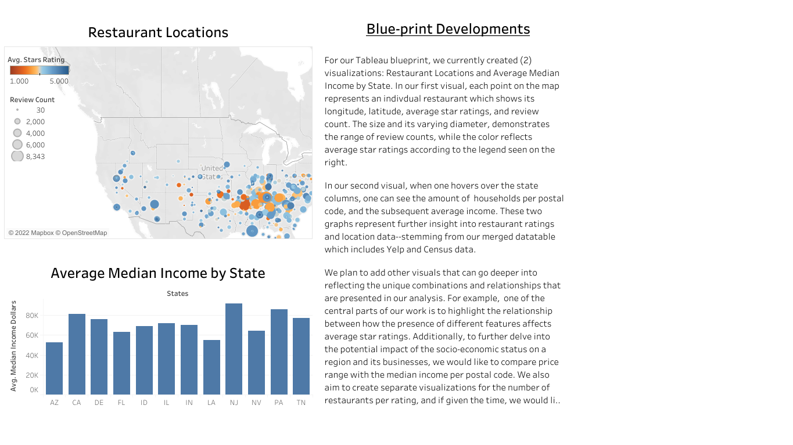
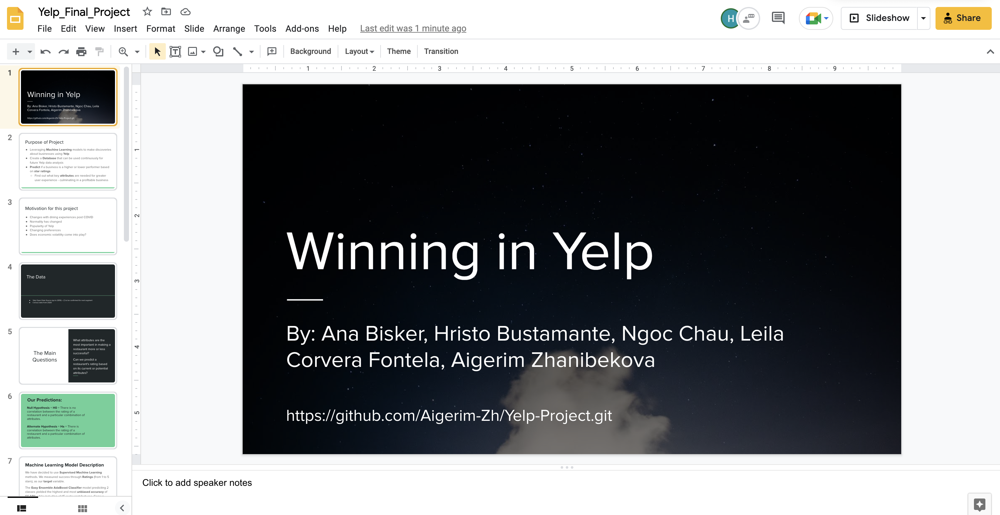

# Yelp Restaurant Performance Prediction 


## Project Abstract 

The purpose of this project is to develop a Machine Learning model that can predict a restaurant's success based on its features. Success is measured through **Star Ratings** - from 1 to 5 stars.

We gathered data from **Yelp** on restaurant attributes and ratings, reviews and users. 

In attempt to achieve these predictions, we set out to develop the best Machine Learning Model that can accurately predict the top restaurant attributes associated with higher or lower ratings. 

Testing a series of Machine Learning models, we hope to establish which one yields the strongest performance. Based on all possible combinations of attributes and additional features, including census data on the postal codes of the restaurant locations in our dataset, the models will make rating predictions. We assume that the model with the strongest performance will be able to accurately make predictions.


---------------------------------------------------------------------------------------

## Motivation 

The COVID-19 pandemic has presented a multitude of constraints and economic downfalls, in which the restaurant industry has taken a big hit. Now, more than ever, restaurant owners can greatly benefit from the insights presented by what consumers currently value the most in the food industry — in order to best stand out from other local competitors. 

By accessing data on the top rated attributes, restaurant owners and investors can learn how to best appeal to the public in such ever-changing times. Just as the nature of our social interactions have changed, so have current demands and trends. Therefore, it is of critical importance for business owners to remain well informed on the story the data tells to better understand social transitions. 

The predictive model developed in this project can be applied to other regions and can also be used by various stakeholders, in analyzing upcoming opportunities and their advantages and disadvantages.


---------------------------------------------------------------------------------------

## Team Members & Communication Protocols

### Our Team

In this group project, responsibilities were shared equally among all team members. Each team member participated in generating content for the various areas of the project. 

This is a layout of responsibilities per area that each member oversees:

| Member                                               | Responsibilities                                             |
| ---------------------------------------------------- | ------------------------------------------------------------ |
| [Aigerim Zhanibekova](https://github.com/Aigerim-Zh) | Machine Learning; Manage the GitHub repository; ERD diagram and SQL schema; README write-up |
| [Ana Bisker](https://github.com/anaorenstein)        | Data Cleaning and Merging; Machine Learning; README write-up; General Project Manager |
| [Hristo Bustamante](https://github.com/hbustamante8) | SQL Database Creation; Data Cleaning and Merging; Machine Learning; README write-up |
| [Leila Corvera Fontela](https://github.com/leilacf)  | SQL Database Creation; Data Cleaning and Merging; README write-up |
| [Ngoc Chau](https://github.com/Ngoclchau)            | Data Cleaning and Merging; Data Extraction; Data Transforming; SQL Database Creation; README write-up |


### Communications

- Team members have allocated a regular slot for weekly meetings over Zoom in addition to the bi-weekly meetings that are had during class. 
- We created a shared Google Drive that contains:
  - Useful Links - Zoom, Project GitHub, Dataset Guide, Project Rubrics
  - Miscellaneous Brainstorming
- Direct Messaging:
  - SMS group messages
  - Slack group


---------------------------------------------------------------------------------------

## Questions We Hope to Answer 

- What attributes are the most important in making a restaurant more or less successful?

- How are the combination of attributes correlated with a restaurant's rating?

- Can we predict a restaurant's rating based on its current or potential attributes? 

- Examples of important attributes:

  - Review Count
  - Median Income(dollars)
  - Total Estimate Households per Postal Code
  - Noise Level
  - Wheelchair Accessibility
  - Delivery 
  - Takeout
  - Outdoor Dining
  - Vegetarian Options
  - Free Wi-Fi

- Are there any significant differences across regions?

  

### Hypotheses

- Null Hypothesis = **H0** = There is no correlation between the rating of a restaurant and a particular combination of attributes.
- Alternate Hypothesis =  **Ha** = There is correlation between the rating of a restaurant and a particular combination of attributes.


---------------------------------------------------------------------------------------

## Data Source

### Yelp Data

The data used in this project is [Yelp's businesses, reviews, and users subset data](https://www.kaggle.com/datasets/yelp-dataset/yelp-dataset?datasetId=10100&language=Python&outputs=null) extracted from Kaggle.

- The original raw data contains business information across metropolitan areas in the USA and Canada. For this project, we will focus on the USA areas. Our raw data included the following states: AZ, CA, CO, DE, FL, HI, ID, IL, IN, LA, MI, MO, MT, NC, NJ, NV, PA, SD, TN, TX, UT, VT, WA.

- The data was last updated on February 16, 2021.

- There were 150,346 records in total, which were filtered to only restaurants. 

- After filtering and cleaning, we have 27,137 records. There are 13 states that are covered by our analysis: AZ, CA, DE, FL, ID, IL, IN, LA, MO, NJ, NV, PA, TN.

  

### Census Data

We visited [Census.gov](https://data.census.gov/cedsci/table) and filtered  by state, income and total household for our census data table.

- Our original data contained 9,745 records.
- After cleaning, we had 9,045 records.


---------------------------------------------------------------------------------------

## Database

As part of this project, we have developed a database in **PostgreSQL** using **pgAdmin**. As demonstrated in the **Entity Relationship Diagram** below, the database consists of four tables:

- Business
- Census Data
- Reviews
- User

The ERD below demonstrates how each table is related to each other and specifies a data type for each column.


- The Census Data table has a one-to-many connection to the Business table through the Postal_Code column.

- The Business table has a one-to-many connection to the Reviews table through the Business_ID.

- The User table has a one-to-many connection to the Reviews table through the User_ID. 

  

### Segment One

We used three tables with synthetic datasets generated through [generatedata.com](https://generatedata.com/generator). 

These were our custom-tailored synthetic datasets:

- [Business.csv](CSV_files/business_2.csv)

- [Reviews.csv](CSV_files/reviews_2.csv)

- [User.csv](CSV_files/user_2.csv)

  

### Segment Two

We merged clean data from Business and Census tables on our **SQL database** and titled the new table **Merged Data**. We used **SQLAlchemy on a Jupyter Notebook** to create a connection for the merged table to be read into the Machine Learning model. 

We will be uploading our Reviews and User Tables to our SQL database in the upcoming segments, for visualization purposes only.

These are the datasets that we have, in fully clean and operational CSV format:

- [Business](CSV_files/Final_Business_Data.csv)

- [Census Data](CSV_files/Census_Data.csv)

- [Reviews](https://drive.google.com/file/d/1GxdcTL88A87F_E813_EBfPYJ1l3jqRm6/view?usp=sharing)

- [User](https://drive.google.com/file/d/1m-aPIg1Ka27wNYApCrMs1Gh5ZQ9SUyFv/view?usp=sharing)

The query created on **PgAdmin** to create tables in the **yelp_DB** SQL database can be visualized [here](SQL/YELP_S2DB_CODE.sql).

Below are screenshots of our **SQL database** per table:


#### Business


#### Census Data


#### Merged Data


---------------------------------------------------------------------------------------

## Data Processing 

### **Yelp data** 

Business, Reviews, User tables - came in JSON format, and it required significant cleaning. 

We executed the following data cleaning tasks: 

- All categorical and text variables were converted into numerical data.
- Filtered the data for restaurants. 
- Checked for data types, duplicates, and null values. 
- In the Business JSON dataset, all attributes of interest were in one column. Each attribute was extracted into a separate column.
- Renamed and reordered columns in a readable format. 
- Split the Review JSONs into 11 files, as data was too large to be manipulated.
- Finally, all JSON files were converted to Pandas DataFrames and then to CSV files.

### **Census data** 

Census table - imported from census.gov in CSV format.

- Columns were separated according our the data target.
- Dropped columns that were not needed and merged the ones that were of interest.
- Renamed and reordered columns in a readable format. 
- Checked for data types, duplicates, and null values. 

All data CSV files were imported into Postgres according to Schemas that were created by queries.


---------------------------------------------------------------------------------------

## Machine Learning

In this section, we will describe our progress in Machine Learning model implementation. We have fundamentally decided to use **Supervised Machine Learning** methods. We measured success through **Ratings** (from 1 to 5 stars), as our target variable.

We began with a **Multiple Linear Regression** model, on **Segment One**. Based on the results from the Linear Regression Model, we moved to **classification models** with a categorical target variable for **Segment Two**.


### Segment One

We used **Multiple Linear Regression** as our method. Our prototype was built with synthetic data that returned numerical predictions which corresponded to ratings. The code can be found [here](Mult_Lin_Reg_test_model.ipynb).

Going forward, we intended to test our analysis and metrics using our real data to select the best predictive model. 


### Segment Two

#### Summary of Findings

Subsequent to submission of Segment One, we inputed our actual data into the Linear Regression model. Doing that, we observed that the R^2 of this model was no higher than 0.13541039205285688. The code for this stage of Machine Learning testing can be found [here](Regression_ML_model.ipynb).

After inspecting the data more closely, we found that the target variable of 'stars ratings' follows a discrete distribution with only 9 unique values. That fact alone eliminated the prospect of keeping the Linear Regression model, which requires the target variable to be continuous values.

We moved to classification models with a categorical target variable. First, we classified the ratings into **four** classes: poor, average, good, and successful. However, we obtained better performance with **two** classes only: lower- and higher-performing restaurants. 

We started with 10 features and added 5 more restaurant features, which increased the accuracy. The models controlling for socio-economic factors such as income and total households tend to perform slightly better. Finally, adding the 'state' feature also slightly improved the model indicating small structural differences across examined regions. 

Having balanced data gave more equal prediction rates across classes and, therefore, the most unbiased overall accuracy. **The Easy Ensemble AdaBoost Classifier** model predicting 2 classes yielded the highest and most unbiased accuracy of **66.68%** while including all 15 restaurant features, Census income and household data, and region control. 

Since the first stage, a series of due diligence tests lead us to **over a 20% accuracy increase** in the strongest model. 

Our **final** Machine Learning Model for **Segment Two Deliverable** can be found [here](Final_ML_Code.ipynb).


### Classification Models and Methods

Below you will find a detailed description of every classification model and method we tested, and their comparisons.

All the code for classification models is saved [here](https://github.com/Aigerim-Zh/Yelp-Project/tree/Aigerim/Machine_Learning_Models). 

We will compare each model based on its overall accuracy score and an F-1 score for each class, a harmonic mean of precision, and recall rates. The F-1 score metric will be used since neither precision nor recall has higher importance, given the topic question.

Below are the four main stages in our machine learning development process. In each stage, we tested the following models:

- **MultiClass Classification Logistic Regression** 
- **Balanced Random Forest** 
- **Easy Ensemble AdaBoost Classifier**


In **Stages 1 to 3**, we used Yelp data's ratings and put them into **four classes**:

* 4.1 to 5 - Successful
* 3.1 to 4 - Good
* 2.1 to 3 - Average
* 1 to 2 - Poor


#### Stage 1. Four Classes with Ten Attributes

In Stage 1, we included 10 restaurant attributes recorded by Yelp:

```
X = business_df[['Review_Count', 'Restaurants_Delivery', 'Outdoor_Seating',
       'Restaurants_TakeOut', 'WiFi', 'Restaurants_Reservations',
       'Good_For_Groups', 'Wheelchair_Accessible', 'Happy_Hour',
       'Dietary_Restrictions']]
```

The dataset has 49,857 observations. 


Based on the results above, we can see that the **MultiClass Classification Logistic Regression** is biased toward the majority classes. That is why we tried the following resampling techniques:

- **Naive Random Oversampling**. Instances of the minority class are randomly selected and added to the training set until the majority and minority classes are balanced.
- **SMOTE Oversampling**. New instances are interpolated. That is, for an instance from the minority class, new values are generated based on its distance from its neighbors.
- **Cluster Centroids Undersamplig**. Akin to SMOTE, the algorithm identifies clusters of the majority class, then generates synthetic data points, called centroids, that are representative of the clusters. The majority class is then undersampled down to the size of the minority class. 
- **SMOTEEN, Combination of Over- and Under-Sampling** combines the SMOTE and Edited Nearest Neighbors (ENN) algorithms. It includes the following steps: 
      1. Oversample the minority class with SMOTE.
      2. Clean the resulting data with an undersampling strategy. If the two of the nearest neighbors of a data point belong to different classes, the data point is dropped.

The results with resampling techniques show an unbiased accuracy rate for both testing and training sets and an F-1 score showing a more equal prediction success distribution. 

The **Naive Random Oversampling** technique for the **MultiClass Logistic Regression** model produced the highest unbiased testing accuracy rate (43.32%) with no overfitting. Moreover, the prediction rate for each class is not very different.

The **Easy Ensemble AdaBoost Classifier** produced the second-highest accuracy rate and predicted each class at a more equal rate than the Logistic Regression, however, the prediction rate for the "Good" class is quite higher than for other classes. The **Balanced Random Forest** model produced overfitting results with the training accuracy above the testing one. 


#### Stage 2. Four Classes with Fifteen Attributes

To further improve the accuracy, we added 5 more restaurant attributes. 

The list of features looks as follows:

```
X = business_df.['Review_Count', 'Restaurants_Delivery', 'Outdoor_Seating',
       'Accepts_CreditCards', 'Price_Range', 'Alcohol', 'Good_For_Kids',
       'Reservations', 'Restaurants_TakeOut', 'WiFi', 'Good_For_Groups',
       'Wheelchair_Accessible', 'Happy_Hour', 'Noise_Level',
       'Dietary_Restrictions''])
```

The number of observations was reduced to 27,207.


The results above show that adding these additional attributes increased the accuracy in all models. This time, the **Easy Ensemble AdaBoost Model** performed slightly better than the **Naive Random Oversampling**.


#### Stage 3. Four Classes with Fifteen Attributes and Census Data

We also wanted to test the data while controlling for socio-economic factors such as income and population. We extracted the Census data from [here](CSV_files/Census_Data.csv). 

We selected the Median Income instead of the Mean Income as per the [feature selection](https://github.com/Aigerim-Zh/Yelp-Project/blob/Aigerim/Machine_Learning_Models/Feature_Selection.ipynb), in which the Median Income had a higher correlation with Stars Ratings. Moreover, as per the feature importance rank as part of all Random Forests models, the Median Income had a higher importance score. 

Now, the set of features looks as follows:

```
X = business_df[['Review_Count', 'Restaurants_Delivery', 'Outdoor_Seating',
       'Accepts_CreditCards', 'Price_Range', 'Alcohol', 'Good_For_Kids',
       'Reservations', 'Restaurants_TakeOut', 'WiFi', 'Good_For_Groups',
       'Wheelchair_Accessible', 'Happy_Hour', 'Noise_Level',
       'Dietary_Restrictions',
         'Total_Estimate_Married-couple_Family_households',
       'Total_Estimate_Nonfamily_households',
                'Median_Income(dollars)', 
                'Total_Estimate_Households_per_Zip']]

```


Adding the Census data decreased the number of observations to 24,739. As it can be seen, the accuracy rate dropped for all Logistic Regression models. However, **the accuracy only slightly improved** for the Balanced Random Forests and Easy Ensemble AdaBoost Classifier models. 

Since the strongest model, the Easy Ensemble AdaBoost Classifier, had some improvement, we will continue including the Census data in the next steps.  


#### Stage 4. Two Classes with Fifteen Attributes and Census Data 

As a next step, we tried categorizing the target variable into two classes: lower- and higher-performing restaurants. It might be more compelling for restaurants to know if they belong to one of these two categories rather than one of the four previous categories.


#### Threshold of 3

We first started with a threshold of 3:

- 1 to 2.9 - Lower Performance
- 3 to 5 - Higher Performance


Reducing the number of classes significantly improved accuracy in all cases. However, as we can see, the two classes are unbalanced with the majority falling into the high-performance category. That is why we run the Logistic Regression model with resampling techniques to balance out the classes and their prediction rates. 

The prediction rates in all last two models seem to be biased toward the majority class.


#### Threshold of 3.5 With and Without State


As a next step, we increased the threshold to 3.5:

- 1 to 3.4 - Lower Performance
- 3.5 to 5 - Higher Performance

Increasing the threshold made classes much more balanced. That is why the Logistic Regression model without resampling techniques was used. 

As we can see, the prediction rates in all models are more balanced out, which makes the overall accuracy more representative. **The strongest model remains the Easy Ensemble AdaBoost Classifier**. 

As we achieved the highest and most unbiased accuracy rate in this step, we wanted to test an additional feature of "State", which might control for some structural differences across regions. 

Adding the State feature slightly improved the performance of **the strongest model to 66.85%**. 


#### Scaling with a StandardScaler()


As the last step, we tried scaling data using a StandardScaler(). As expected, the results almost stayed the same as the models are not sensitive to scaling.


#### Feature Importance


Although the Balanced Random Forest produced overfitting results in the majority of settings, its feature importance calculator is useful. In the chart above, all features are ranked according to their importance. Although we tried removing less important features, the accuracy score dropped slightly, i.e., all less important features collectively make a meaningful contribution to the model.

In the next section, the actual relation of each feature to the restaurant's classification will be examined.


#### Correlation Matrix


Before running our models, we examined the correlation among all features and ratings. As it can be seen, most of features do not have a very strong correlation with the ratings. Nevertheless, these features constitute an important part of the restaurant's performance as shown by the Machine Learning models. 

We can also see a relatively high correlation among the Census population features of the Total Households Per Zip, Total Married Households Per Zip, and Total Non-Family Households Per Zip. This observation is expected as all these values are representative of population. However, leaving only one population proxy did not affect the models. 


-----------------------------------------------------------------------------------------

## Dashboard

We used **Tableau** to create and host our dashboard.  We made a blueprint Tableau dashboard that can be seen [here](https://public.tableau.com/shared/Q7987888K?:display_count=n&:origin=viz_share_link). 

Screenshot below:




We may explore using interactive Javascript interface to demonstrate our model, if we have time.


-----------------------------------------------------------------------------------------

## Project Presentation 

Google Slides will be for our live presentation. The draft of our presentation slides can be seen [here](https://docs.google.com/presentation/d/18GWN6LmhtkoVwcq43I3RUQ_keQdY6Q2PWb0nEIa3FOg/edit?usp=sharing).

Screenshot of the initial screen of our presentation below:




-----------------------------------------------------------------------------------------

## Areas for Future Analysis

### Sentiment Analysis on Reviews

The unexplained part of the model may come from other features that might be restaurant-specific such as cleaniness, menu and food attributes, service attributes such as the number of servers, politeness of stuff, etc. 

However, these data are not available in Yelp attributes but can be extracted based on key words from review comments. In general, review comments analysis might reveal other factors determining success in the restaurant industry.

### Deeper study into User Yelp profiles


-----------------------------------------------------------------------------------------

## Areas for Improvement 

[TBD]


