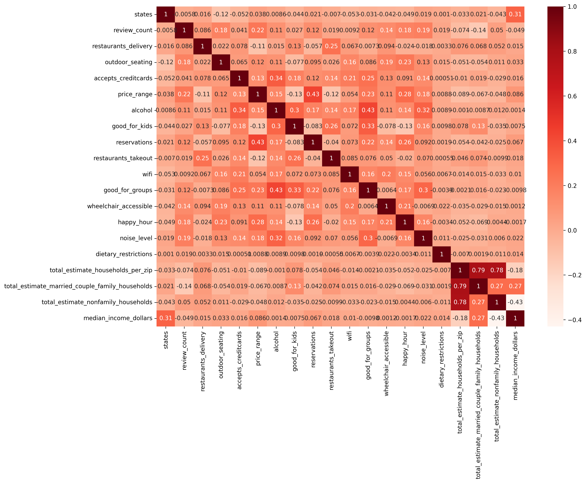

# Yelp Restaurant Performance Prediction 

## Project Abstract 

The purpose of this project is to develop a Machine Learning model that can predict a restaurant's success based on its features. Success is measured through **Star Ratings** - from 1 to 5 stars.

We gathered data from **Yelp** on restaurant attributes and ratings, reviews and users. 

In an attempt to achieve these predictions, we set out to develop the best Machine Learning Model that can accurately predict the top restaurant attributes associated with higher or lower ratings. 

Testing a series of Machine Learning models, we hope to establish which one yields the strongest performance. Based on all possible combinations of attributes and additional features, including census data on the postal codes of the restaurant locations in our dataset, the models will make rating predictions. We assume that the model with the strongest performance will be able to accurately make predictions.

---------------------------------------------------------------------------------------

## Motivation 

The COVID-19 pandemic has presented a multitude of constraints and economic downfalls, in which the restaurant industry has taken a big hit. Now, more than ever, restaurant owners can greatly benefit from the insights presented by what consumers currently value the most in the food industry — in order to best stand out from other local competitors. 

By accessing data on the top-rated attributes, restaurant owners and investors can learn how to best appeal to the public in such ever-changing times. Just as the nature of our social interactions has changed, so have current demands and trends. Therefore, it is of critical importance for business owners to remain well informed on the story the data tells to better understand social transitions. 

The predictive model developed in this project can be applied to other regions and can also be used by various stakeholders, in analyzing upcoming opportunities and their advantages and disadvantages.

---------------------------------------------------------------------------------------

## Our Team

In this group project, responsibilities were shared equally among all team members. Each team member participated in generating content for the various areas of the project. 

This is a layout of responsibilities per area that each member oversees:

| Member                                               | Responsibilities                                             |
| ---------------------------------------------------- | ------------------------------------------------------------ |
| [Aigerim Zhanibekova](https://github.com/Aigerim-Zh) | Machine Learning; Manage the GitHub repository; ERD diagram and SQL schema; README write-up; Dashboard Creation |
| [Ana Bisker](https://github.com/anaorenstein)        | Data Cleaning and Merging; Machine Learning; README write-up; General Project Manager; Dashboard Creation |
| [Hristo Bustamante](https://github.com/hbustamante8) | SQL Database Creation; Data Cleaning and Merging; Machine Learning; README write-up; Dashboard Creation |
| [Leila Corvera Fontela](https://github.com/leilacf)  | SQL Database Creation; Data Cleaning and Merging; README write-up; Dashboard Creation |
| [Ngoc Chau](https://github.com/Ngoclchau)            | Data Cleaning and Merging; Data Extraction; Data Transforming; SQL Database Creation; README write-up; Dashboard Creation |

---------------------------------------------------------------------------------------

## Questions We Hope to Answer

- What attributes are the most important in making a restaurant more or less successful?

- How are the combination of attributes correlated with a restaurant's rating?

- Can we predict a restaurant's rating based on its current or potential attributes? 

- Examples of important attributes:

  - Review Count
  - Median Income(dollars)
  - Total Estimate Households per Postal Code
  - Noise Level
  - Wheelchair Accessibility
  - Delivery 
  - Takeout
  - Outdoor Dining
  - Vegetarian Options
  - Free Wi-Fi

- Are there any significant differences across regions?

  

### Hypotheses

- Null Hypothesis = **H0** = There is no correlation between the rating of a restaurant and a particular combination of attributes.
- Alternate Hypothesis =  **Ha** = There is a correlation between the rating of a restaurant and a particular combination of attributes.

---------------------------------------------------------------------------------------

## Data Source

### Yelp Data

The data used in this project is [Yelp's businesses, reviews, and users subset data](https://www.kaggle.com/datasets/yelp-dataset/yelp-dataset?datasetId=10100&language=Python&outputs=null) extracted from Kaggle.

- The original raw data contains business information across metropolitan areas in the USA and Canada. For this project, we will focus on the USA area. Our raw data included the following states: AZ, CA, CO, DE, FL, HI, ID, IL, IN, LA, MI, MO, MT, NC, NJ, NV, PA, SD, TN, TX, UT, VT, WA.

- The data was last updated on February 16, 2021.

- There were 150,346 records in total, which were filtered to only restaurants. 

- After filtering and cleaning, we have 27,137 records. There are 13 states that are covered by our analysis: AZ, CA, DE, FL, ID, IL, IN, LA, MO, NJ, NV, PA, and TN.

  

### Census Data

We visited [Census.gov](https://data.census.gov/cedsci/table) and filtered by state, income, and total household for our census data table.

- Our original data contained 9,745 records.
- After cleaning, we had 9,045 records.

---------------------------------------------------------------------------------------

## Database

As part of this project, we have developed a database in **PostgreSQL** using **pgAdmin**. As demonstrated in the **Entity Relationship Diagram** below, the database consists of four tables:

- Business
- Census Data
- Reviews
- User

The ERD below demonstrates how each table is related to each other and specifies a data type for each column.

- The Census Data table has a one-to-many connection to the Business table through the Postal_Code column.

- The Business table has a one-to-many connection to the Reviews table through the Business_ID.

- The User table has a one-to-many connection to the Reviews table through the User_ID. 

  

### Segment One

We used three tables with synthetic datasets generated through [generatedata.com](https://generatedata.com/generator). 

These were our custom-tailored synthetic datasets:

- [Business.csv](CSV_files/business_2.csv)

- [Reviews.csv](CSV_files/reviews_2.csv)

- [User.csv](CSV_files/user_2.csv)

  

### Segments Two

We merged clean data from Business and Census tables on our **SQL database** and titled the new table **Merged Data**. We used **SQLAlchemy on a Jupyter Notebook** to create a connection for the merged table to be read into the Machine Learning model. 

We aim to upload our Reviews and User Tables to our SQL database in the upcoming segments, for visualization purposes only.

These are the datasets that we have, in full clean and operational CSV format:

- [Business](CSV_files/Final_Business_Data.csv)

- [Census Data](CSV_files/Census_Data.csv)

- [Reviews](https://drive.google.com/file/d/1GxdcTL88A87F_E813_EBfPYJ1l3jqRm6/view?usp=sharing)

- [User](https://drive.google.com/file/d/1m-aPIg1Ka27wNYApCrMs1Gh5ZQ9SUyFv/view?usp=sharing)

The query created on **PgAdmin** to create tables in the **yelp_DB** SQL database can be visualized [here](SQL/YELP_S2DB_CODE.sql).

Below are screenshots of our **SQL database** per table:

#### Business

#### Census Data

#### Merged Data

### Segment Three

We attempted to upload our **Reviews** and **User** Tables to our SQL database in the upcoming segments, for visualization and future uses only but were not successful as the datasets were too large.

Instead, we stored our datasets in a shared Google Drive which can be found here:

- **[Reviews](https://drive.google.com/file/d/1GxdcTL88A87F_E813_EBfPYJ1l3jqRm6/view?usp=sharing)**
- [**Users**](https://drive.google.com/file/d/1m-aPIg1Ka27wNYApCrMs1Gh5ZQ9SUyFv/view?usp=sharing)

For future use and further research, we would use AWS and Postgres to store and manipulate the data. 

---------------------------------------------------------------------------------------

## Data Processing 

### **Yelp data** 

Business, Reviews, User tables - came in JSON format, and it required significant cleaning. 

We executed the following data cleaning tasks: 

- All categorical and text variables were converted into numerical data.
- Filtered the data for restaurants. 
- Checked for data types, duplicates, and null values. 
- In the Business JSON dataset, all attributes of interest were in one column. Each attribute was extracted into a separate column.
- Renamed and reordered columns in a readable format. 
- Split the Review JSONs into 11 files, as data was too large to be manipulated.
- Finally, all JSON files were converted to Pandas DataFrames and then to CSV files.

### **Census data** 

Census table - imported from census.gov in CSV format.

- Columns were separated according to the data target.
- Dropped columns that were not needed and merged the ones that were of interest.
- Renamed and reordered columns in a readable format. 
- Checked for data types, duplicates, and null values. 

All data CSV files were imported into Postgres according to Schemas that were created by queries.

---------------------------------------------------------------------------------------

## Machine Learning         

In this section, we will describe our progress in Machine Learning model implementation. We have fundamentally decided to use **Supervised Machine Learning** methods. We measured success through **Ratings** (from 1 to 5 stars), as our target variable.

We began with a **Multiple Linear Regression** model, on **Segment One**. Based on the results from the Linear Regression Model, we moved to **classification models** with a **categorical** target variable for **Segment Two**.

On **Segment Three** we scaled the data and experimented with different kernel settings in **SVM**.

### Segment One

We used **Multiple Linear Regression** as our method. Our prototype was built with synthetic data that returned numerical predictions which corresponded to ratings. The code can be found [here](Mult_Lin_Reg_test_model.ipynb).

Going forward, we intended to test our analysis and metrics using our real data to select the best predictive model. 

### Segment Two

Subsequent to the submission of Segment One, we input our actual data into the Linear Regression model. Doing that, we observed that the R^2 of this model was no higher than 0.14. The code for this stage of Machine Learning testing can be found [here](Regression_ML_model.ipynb).

After inspecting the data more closely, we found that the target variable of 'stars ratings' follows a discrete distribution with only 9 unique values. That fact alone eliminated the prospect of keeping the Linear Regression model, which requires the target variable to be continuous values.

### Classification Models and Methods

We moved to classification models with a categorical target variable. Before arriving at our strongest-performing model, we went through a series of due diligence stages. In each stage, we tested the following models:
  - **MultiClass Classification Logistic Regression** and its **Resampling Techniques** to address the classes imbalance
  - **Balanced Random Forest** 
  - **Easy Ensemble AdaBoost Classifier**

### Steps to Arrive at the Best Peforming Model

First, we classified the ratings into **four** classes: poor, average, good, and successful. 
  - We started with 10 features and added 5 more restaurant features, which increased the accuracy. 
  - Furthermore, we added socio-economic controls such as income and total households, which slightly increased the accuracy further. 

However, we obtained a **stronger performance with two classes** only: lower- and higher-performing restaurants. 
  - We adjusted the threshold dividing the two classes to eliminate class imbalance. Having balanced data gave more equal prediction rates across classes and, therefore, the most unbiased overall accuracy. 
  - Finally, adding the 'state' feature also slightly improved the model indicating small structural differences across examined regions. 

We compared each model based on its overall accuracy score and an F-1 score for each class, a harmonic mean of precision, and recall rates. The F-1 score metric was used since neither precision nor recall has higher importance, given the topic question.

**The Easy Ensemble AdaBoost Classifier** model predicting 2 classes yielded the highest and most unbiased accuracy of **66.68%**. The model features included all 15 restaurant features, Census income and household data, and region control. The code for **the Final Machine Learning Model** can be found [here](Final_ML_2.ipynb).

Since the first stage, a series of verification tests lead us to **over a 20% accuracy increase** in the strongest model. 

### Steps that Did Not Improve the Strongest Model Further
- Scaling data and running all models again.
- Testing further with the **Support Vector Machine** model [see here](https://github.com/Aigerim-Zh/Yelp-Project#segment-three-1).

You can find **more details** on our Machine Learning model development process here:
  - [Here](Stages.md) you can read a detailed description of every classification model and method we tested, and their comparisons. 
  - All the code for classification models is saved [here](https://github.com/Aigerim-Zh/Yelp-Project/tree/main/Machine_Learning_Models). 

**_NOTE_**: all experimental stages of the Machine Learning process were conducted using CSV files. The CSV data for the final model had **24,739 observations** and yielded **66.85% accuracy**. However, some of the observations had damaged address entries and had to be dropped during the Database Creation stage. Therefore, the final file connecting to the database now only uses **24,681 observations**, which dropped the accuracy to **66.68%**. This incident might indicate that having more observations could give us more accuracy.  

### Feature Importance

Although the Balanced Random Forest produced overfitting results in the majority of settings, its feature importance calculator is useful. In the chart below, all features are ranked according to their importance. Although we tried removing less important features, the accuracy score dropped slightly, i.e., all less important features collectively make a meaningful contribution to the model.

### Correlation Matrix

Before running our models, we examined the correlation among all features and ratings. As it can be seen, most of the features do not have a very strong correlation with the ratings. Nevertheless, these features constitute an important part of the restaurant's performance as shown by the Machine Learning models. 

We can also see a relatively high correlation among the Census population features of the Total Households Per Zip, Total Married Households Per Zip, and Total Non-Family Households Per Zip. This observation is expected as all these values are representative of the population. However, leaving only one population proxy did not affect the models. 

### Segment Three

We did research and tested various _Support Vector Machine_ or **SVM** machine learning methods. After scaling the data with _StandardScaler()_, we reached the best performance with *rbf* kernel, random_state=1, gamma=0.05, C=0.01. There was **zero** overfitting but the accuracy was still much lower than the AdaBoost Ensemble classifier. We acknowledged that there may be parameters we are not yet familiar with in **SVM**. Had we had more time and a larger number of observations, this model may have been a promising prospect. The code can be seen [here](svm_model_stnd_scaler_rbf.ipynb).

-----------------------------------------------------------------------------------------

## Dashboard

We used **Tableau** to create and host our dashboard.  We made a blueprint Tableau dashboard that can be seen [here](https://public.tableau.com/app/profile/ana.bisker/viz/YelpFinalProject/ByStateDashboard?publish=yes). 

Screenshot below:

We may explore using an interactive Javascript interface to demonstrate our model if we have time.

-----------------------------------------------------------------------------------------

## Project Presentation 

Google Slides will be for our live presentation. The draft of our presentation slides can be seen [here](https://docs.google.com/presentation/d/18GWN6LmhtkoVwcq43I3RUQ_keQdY6Q2PWb0nEIa3FOg/edit?usp=sharing).

Screenshot of the initial screen of our presentation below:

-----------------------------------------------------------------------------------------

## Areas for Future Analysis

- Sentiment Analysis on Reviews
  - The unexplained part of the model may come from other features that might be restaurant-specific such as cleanliness, menu and food attributes, service attributes such as the number of servers, politeness of staff, etc.
  - However, these data are not available in Yelp attributes but can be extracted based on keywords from review comments. In general, review comments analysis might reveal other factors determining success in the restaurant industry.

- A deeper study into User Yelp profiles
  - Analyzing user profiles based on data from the User table on Yelp data

-----------------------------------------------------------------------------------------

## Areas for Improvement 

[TBD]
